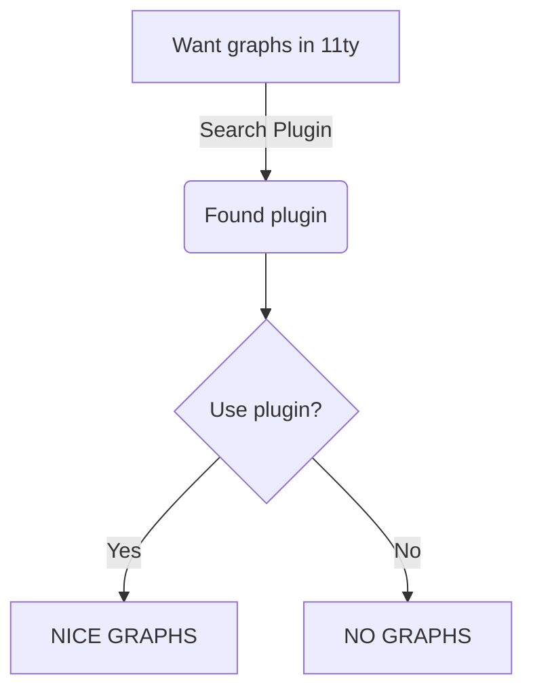

this is a draft post set to future using the ``` scheduled ``` property on the frontmatter, the post would only be built/generated when the scheduled date gets passed


Leverage agile frameworks to provide a robust synopsis for high level overviews. Iterative approaches to corporate strategy foster collaborative thinking to further the overall value proposition. Organically grow the holistic world view of disruptive innovation via workplace diversity and empowerment.

Bring to the table win-win survival strategies to ensure proactive domination. At the end of the day, going forward, a new normal that has evolved from generation X is on the runway heading towards a streamlined cloud solution. User generated content in real-time will have multiple touchpoints for offshoring.


## Section Header

Capitalize on low hanging fruit to identify a ballpark value added activity to beta test. Override the digital divide with additional clickthroughs from DevOps. Nanotechnology immersion along the information highway will close the loop on focusing solely on the bottom line.

```js/2-3
// this is a command
function myCommand() {
	let counter = 0;
	counter++;
}
```

## MermaidJS diagram 

There's a plugin for that!

