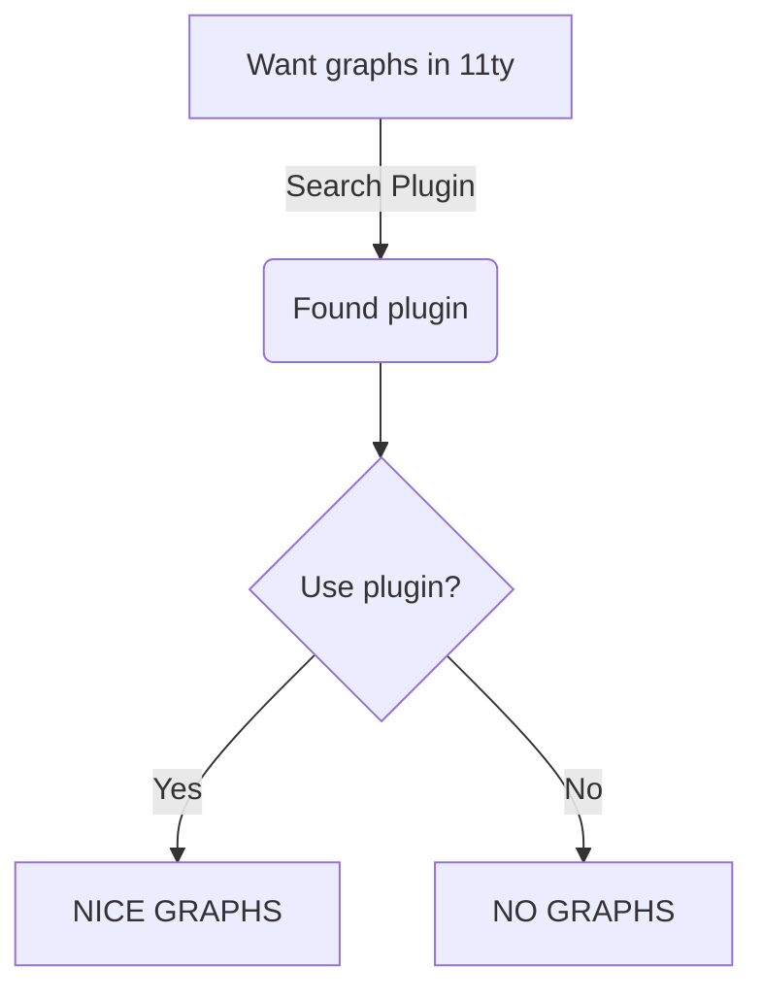

# What is this?

Blah blah blah

## Cool, but why?

Blah blah blah

### Okay, show me the info.

Sweet!
Some diagram:

```mermaid
	graph TD;
	A[Want graphs in 11ty] -->|Search Plugin| B(Found plugin);
	B --> C{Use plugin?};
	C -->|Yes| D[NICE GRAPHS];
	C -->|No| E[NO GRAPHS];
```